# programmers-path
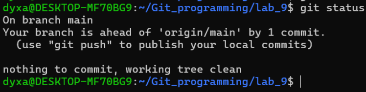

Используем git status, чтобы узнать, на какой ветке находимся.

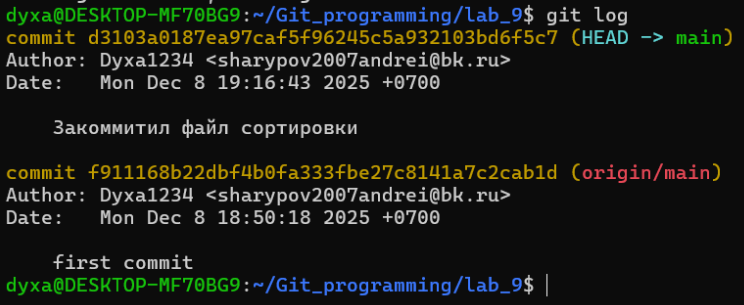

Вывод git log.

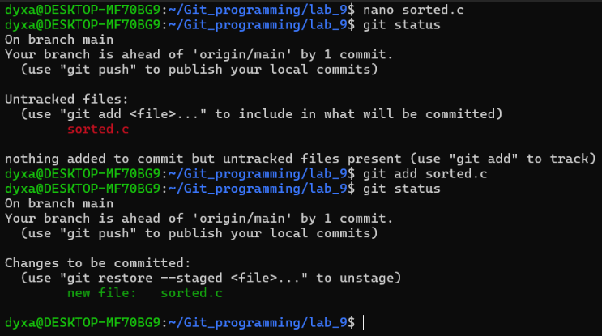

Создадим файл sorted.c и выведим статус. Git предупреждает нас о том, что ветка main содержит 1 коммит, который еще не отправлен на удаленный сервер origin, а также что файл sorted.c е отслеживается.

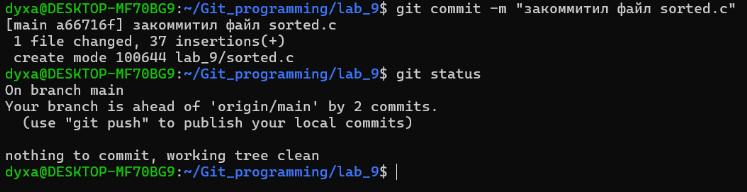

Добавили файл в облость stage.

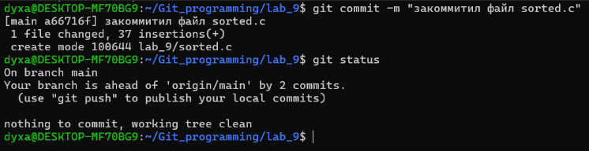

Закоммитил файл sorted.c и вывел statu

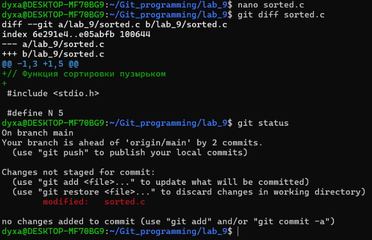

Добавил информацию в файл sorted.c, Git сообщает о том, что изменения еще не добавлены в staging area.

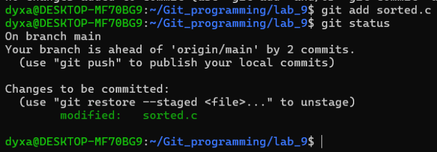

Добавил информацию в stage, на пока что не закоммитил.

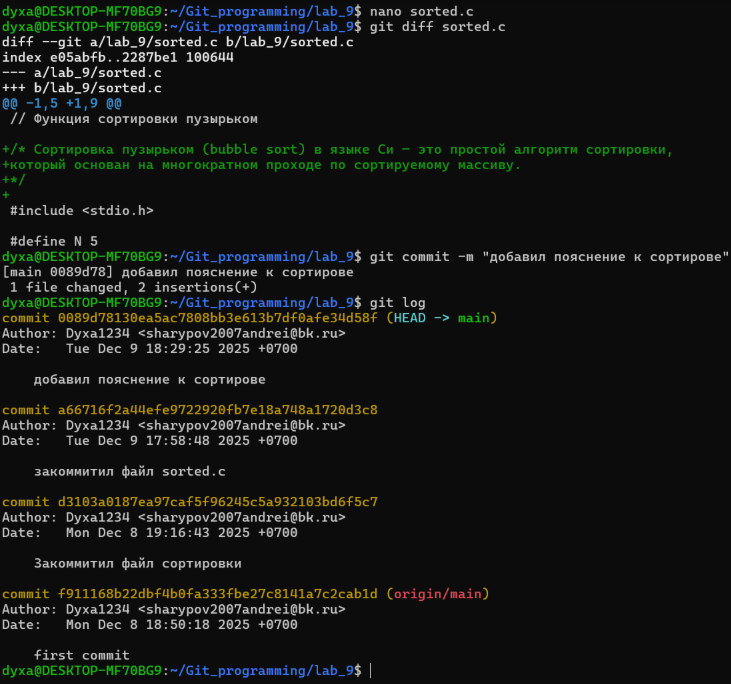

Доболнил информацию в файле sorted.c, после чего закоммитил и вывел журнал.

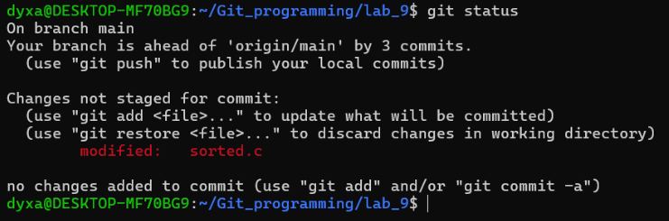
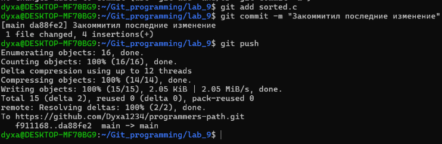

Перенес файл в область stage, закоммитил и запушил на удаленный реп.

Работа с ветками.

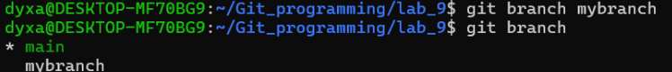

Создал ветку mybranch и проверил на какой ветке нахожусь.

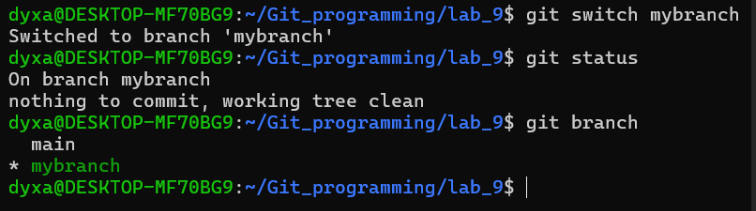
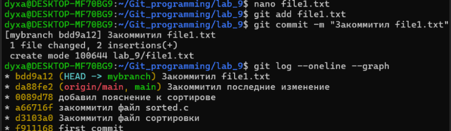
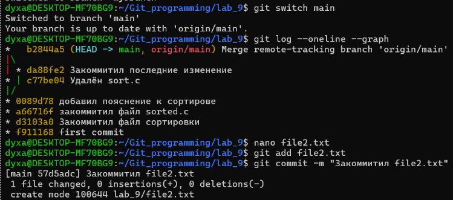

После переключения на другую ветку команда git status показывает, в какой ветке мы находимся. Когда мы вернулись в ветку main и использовали команду git log --oneline –graph, в журнале не было коммитов из mybranch.

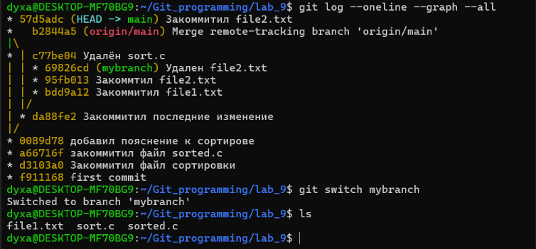

Наш файл file2.txt пропал.

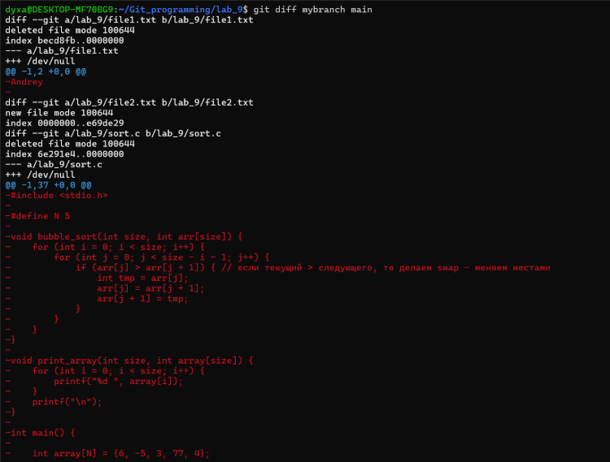

Оценка 4.

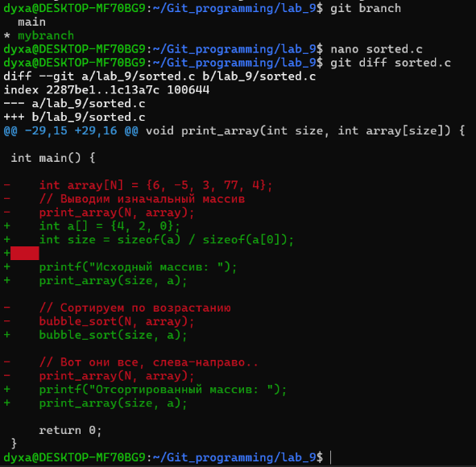

Git giff показывает, что изменилось в файле sorted.c

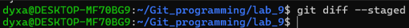

git diff --staged пустой

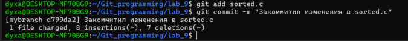
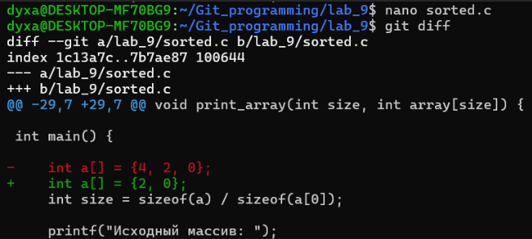

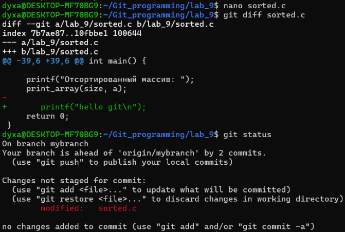

Добавил строку "printf("hello git\n");" в файл sorted.c, но изменения не добавлены в stage, также Git предлагает использовать git restore sorted.c для отмены изменений в рабочей директории.

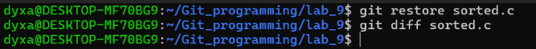
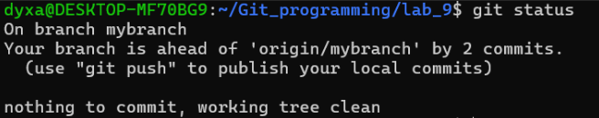

После команды git restore sorted.c файл Sort.c выглядит так (т. е. наша строка printf(“hello git\n”) исчезла):

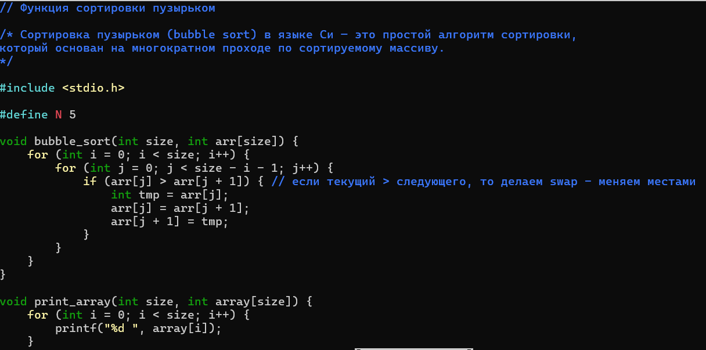

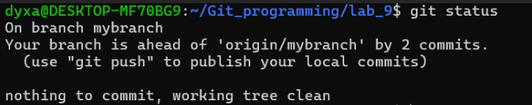

Git status советует нам отправить ветку в удаленный репозиторий.

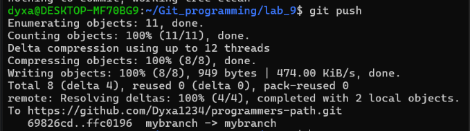

Часть 2

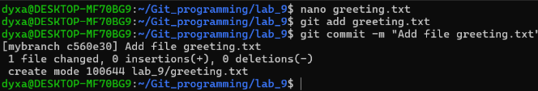
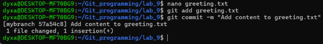
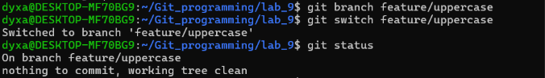

Git status показывает, что мы находимся в ветке feature/uppercase.

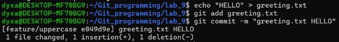
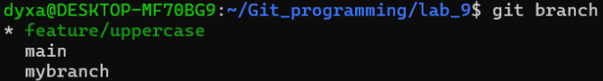
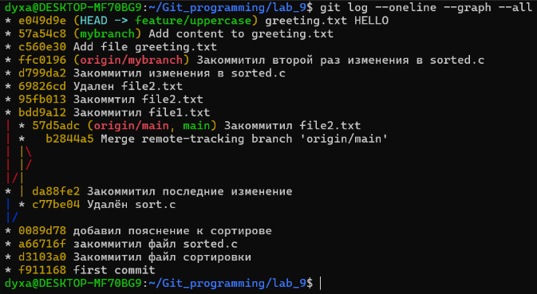

Когда мы перейдем в основную ветку, cat выведет hello, а после объединения веток — HELLO.

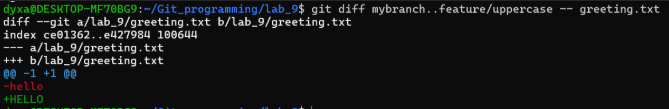

Git Показывает, что изменилось в ветке feature/uppercase относительно того момента, когда она отделилась от mybranch, но только для файла greeting.txt.

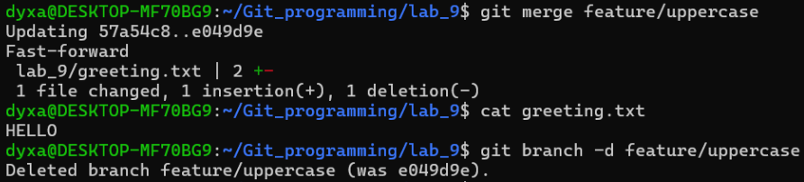
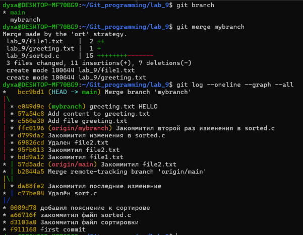
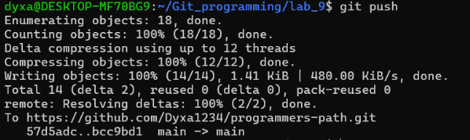

Оценка 5

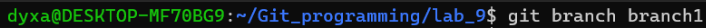
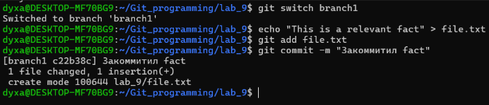
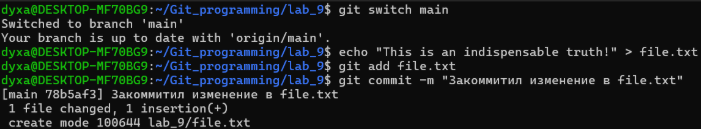
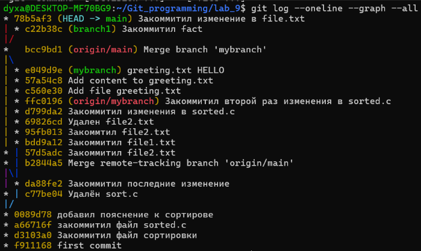

Из журналы мы можем узнать, что находимся в ветке main на коммите 78b5af3
main опережает origin/main
mybranch опережает origin/mybranch
Ветки main и branch1 расходятся после коммита bcc9bd1

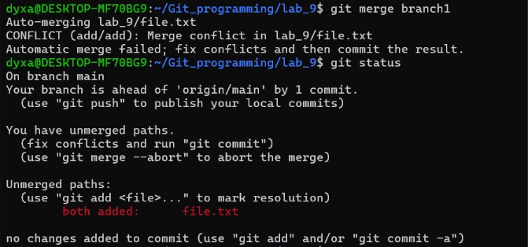
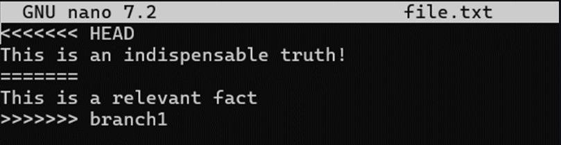
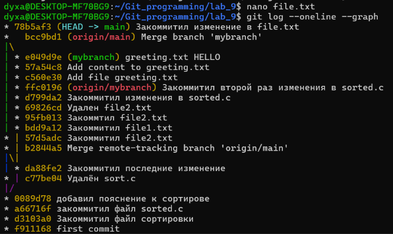
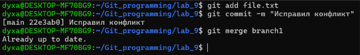
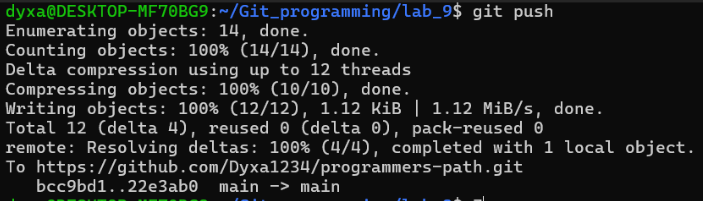

Починим Merge конфликты для сортировки MergeSort на python.

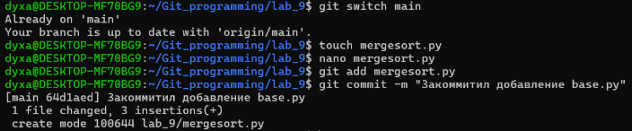
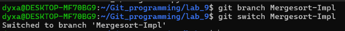

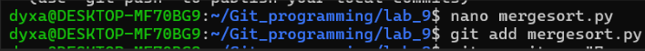
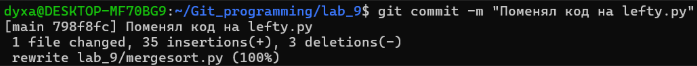
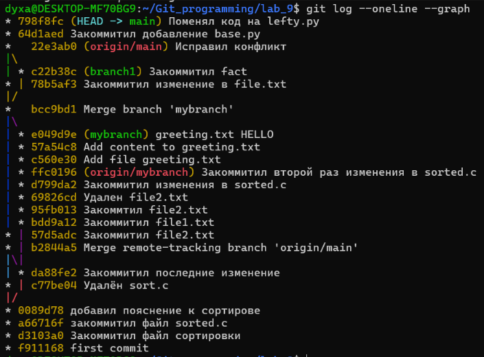

